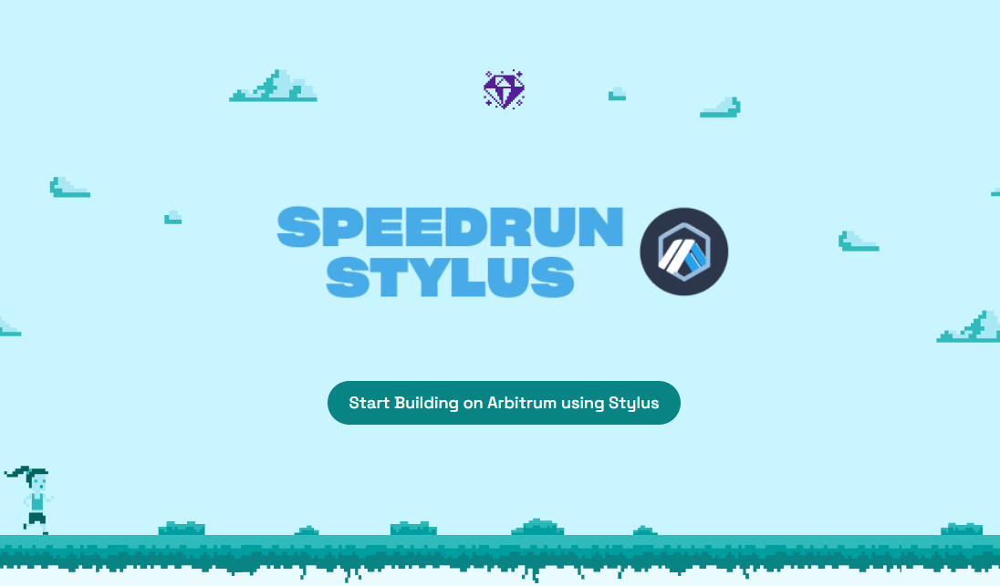

# 🏃‍♀️ Speed Run Stylus 


Speed Run Stylus aims to provide a structured learning path for onboarding developers to Arbitrum.

---

## Project setup

Get the project code:

```bash
git clone https://github.com/abhi152003/speedrun-stylus.git

cd speedrun-stylus
```

Install dependencies:

```bash
yarn install
```

Start the backend service:

```bash
yarn backend
```

In a new terminal, start the frontend:

```bash
yarn start
```

At this point, you should have the app available at <http://localhost:3000>. By default, a locale JSON file (`packages/backend/local_database/local_db.json`) is used as the database. This is intended for testing and demo usage. In order to set it up for production usage, we provide a Firebase database adaptor. You can also easily create your own database adapter (check `packages/backend/services/db.js`).

---

## Firebase Setup (optional)

If you want to use Firebase (firestore) for data storage, you'll need to create a Firebase project and download the service account key configuration. You can generate and download the service account file at <https://console.cloud.google.com/> by 1.) select your Firebase project, 2.) go to IAM & Admin > Service Accounts, 3.) create a service account or click one that is already created, 4.) go to keys of that account, and 5.) Add Key > Create key and select a JSON key type.

Then you will have to create a `.env` file in `packages/backend/` with `DATABASE_SERVICE=firebase` and add the full path to the service account file in `GOOGLE_APPLICATION_CREDENTIALS` (see a sample here `packages/backend/.env.sample`).

Then re-run:

```bash
yarn backend
```
